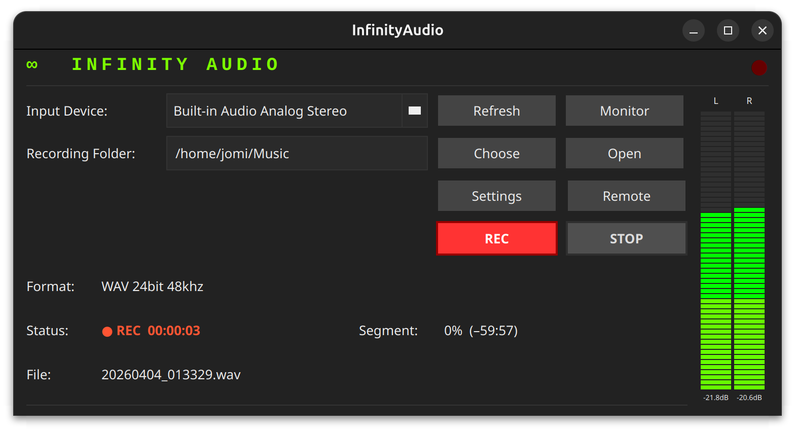

# ∞ InfinityAudio

**Professional continuous audio recorder — C++/Qt6, zero dependencies.**



Record broadcast-quality audio continuously with automatic 1-hour file segmentation, real-time dual-channel VU meters, and a built-in web remote control panel.

---

## Features

- **Continuous recording** — automatic 1-hour WAV segments, never misses a beat
- **High-quality formats** — WAV or AIFF, 16-bit 44.1 kHz / 24-bit 48 kHz / 24-bit 96 kHz
- **Real-time VU meters** — dual-channel (L/R) with dB readings
- **Audio monitor** — listen back through any output device while recording
- **Web remote panel** — control recording from any device on the network via browser
- **Audio streaming** — monitor live audio in the browser via the web panel
- **Watchdog** — auto-restarts recording if anything goes wrong
- **Debian package** — `.deb` installer with desktop launcher and icon
- **Zero external dependencies** — no NDI SDK, no FFmpeg, no libav

---

## Web Remote Panel

Start the remote server from **Remote** → set a port and optional password.

Open `http://<machine-ip>:<port>` in any browser to:

| Endpoint | Description |
|---|---|
| `GET /` | Web control panel (HTML) |
| `GET /status` | JSON status (recording, filename, elapsed) |
| `GET /inputs` | JSON list of audio input devices |
| `POST /rec` | Start recording |
| `POST /stop` | Stop recording |
| `GET /set-input?device=NAME` | Switch input device |
| `GET /monitor?enabled=1\|0` | Toggle web audio monitor |
| `GET /audio.wav` | Live audio stream (Web Audio API) |

---

## Build

### Linux (Ubuntu / Debian)

```bash
sudo apt install cmake ninja-build qt6-base-dev qt6-multimedia-dev qt6-base-dev-tools libqt6network6

chmod +x build_scripts/build-linux.sh
./build_scripts/build-linux.sh

# Binary at:
./build-linux/InfinityAudio
```

### Build Debian package (.deb)

```bash
cd build-linux
cpack -G DEB
# Output: infinityaudio_0.1.0_amd64.deb
sudo dpkg -i infinityaudio_0.1.0_amd64.deb
```

### Windows (MSYS2 / UCRT64)

```bash
# In MSYS2 UCRT64 terminal:
pacman -S mingw-w64-ucrt-x86_64-qt6-multimedia mingw-w64-ucrt-x86_64-cmake ninja

cmake --preset ucrt64-release
cmake --build --preset ucrt64-release
```

### macOS

```bash
brew install qt cmake ninja
cmake -S . -B build-mac -G Ninja -DCMAKE_BUILD_TYPE=Release \
      -DCMAKE_PREFIX_PATH="$(brew --prefix qt)"
cmake --build build-mac --parallel
```

---

## Project structure

```
InfinityAudio/
├── CMakeLists.txt
├── CMakePresets.json
├── main.cpp
├── wav_writer.h / .cpp        — WAV writer (24-bit, no FFmpeg)
├── recorder.h / .cpp          — QAudioSource capture + hourly rotation
├── watchdog.h / .cpp          — auto-restart watchdog
├── ui_widget.h / .cpp         — main window
├── vu_meter_widget.h / .cpp   — dual-channel VU meter (QPainter)
├── web_server.h / .cpp        — built-in HTTP remote control server
├── packaging/
│   ├── infinityaudio.desktop  — Linux desktop launcher
│   └── icons/
│       └── infinityaudio.svg  — infinity symbol icon
├── build_scripts/
│   └── build-linux.sh         — Linux one-step build script
└── docs/
    └── screenshot.png
```

---

## Dependencies

| Library | Notes |
|---|---|
| **Qt 6.4+** | Core, Gui, Widgets, Multimedia, Network |
| **CMake 3.21+** | Build system |
| **Ninja** | Recommended (or Unix Make) |

No NDI SDK, no FFmpeg, no libav — zero extra dependencies.

---

## Settings

- **Input Device** — select any available audio input
- **Recording Folder** — destination for recorded files
- **Container** — WAV or AIFF
- **Audio Profile** — 16-bit 44.1 kHz / 24-bit 48 kHz / 24-bit 96 kHz
- **Remote** — configure port and password for the web panel

Settings are persisted via `QSettings` and restored on next launch.

---

## File naming

Files are named by timestamp only: `YYYYMMDD_HHMMSS.wav`

---

## License

MIT

---

> Built with C++17 and Qt6. Designed for broadcast and professional audio environments.
